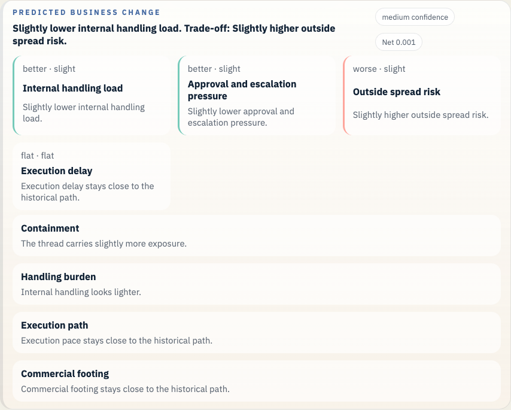
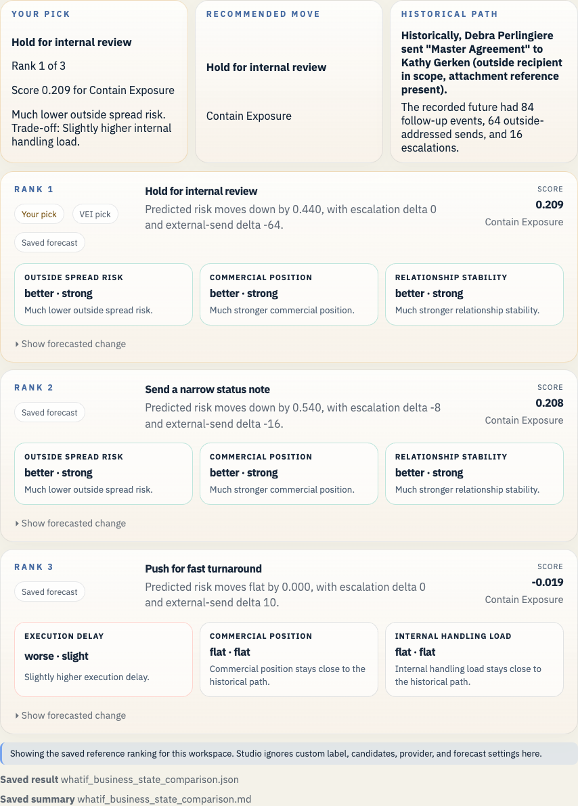

# Enron Master Agreement Example

This folder is a repo-owned saved Enron what-if example. It lets a fresh clone open a real historical branch point, inspect the dated public-company context that was already known by that branch date, and read the saved compare-path results without depending on ignored local output folders.

## Open It In Studio

```bash
vei ui serve \
  --root docs/examples/enron-master-agreement-public-context/workspace \
  --host 127.0.0.1 \
  --port 3055
```

Open `http://127.0.0.1:3055`.

Studio shows the saved reference result for this workspace. It keeps the real branch scene, public-company context, saved forecast, and saved ranking visible from a fresh clone. It ignores custom prompt, label, mode, provider, and candidate changes in the what-if panel when the full Enron archive is absent.

## What This Example Covers

- Historical branch point: Debra Perlingiere sending the `Master Agreement` draft to Cargill on September 27, 2000
- Saved branch scene: 6 prior messages and 84 recorded future events
- Public-company slice at that date: 5 financial checkpoints and 6 public-news events
- Bounded LLM path: keep the draft inside Enron, ask Gerald Nemec for legal review, and hold the outside send
- JEPA forecast: same 84-event horizon, risk from `1.000` to `0.983`, outside-send delta `-29`
- Business-state readout: the saved forecast now translates those proxy shifts into decision language such as outside spread risk, handling burden, execution delay, and commercial position
- Repo-owned comparison: three candidate moves are ranked in `whatif_business_state_comparison.*` using the same saved branch workspace and proxy forecast path

## What It Shows

VEI starts from the real September 27, 2000 outside send, keeps only the public-company facts that were already known on that date, and then compares alternate moves against the recorded future. The saved single-run result keeps the same 84-event horizon, predicts 29 fewer outside sends, and nudges the risk score from `1.000` to `0.983`.



The saved ranked comparison turns that into a choice. `Hold for internal review` comes out best at `0.352`, `Send a narrow status note` is still positive at `0.155`, and `Push for fast turnaround` falls to `-0.019`.



## Files

- `workspace/`: saved workspace you can open in Studio
- `whatif_experiment_overview.md`: short human-readable run summary
- `whatif_experiment_result.json`: saved combined result for the example bundle
- `whatif_llm_result.json`: bounded message-path result
- `whatif_ejepa_result.json`: JEPA forecast result
- `whatif_business_state_comparison.md`: three-way comparison in business language for the saved branch scene
- `whatif_business_state_comparison.json`: structured version of that comparison

For general saved bundles, the canonical workspace files are `workspace/context_snapshot.json`, `workspace/episode_manifest.json`, and `workspace/whatif_public_context.json`, plus the experiment core files. This repo-owned Enron example intentionally includes the ranked comparison sidecars.

## Refresh

```bash
python scripts/build_enron_business_state_example.py
python scripts/validate_whatif_artifacts.py docs/examples/enron-master-agreement-public-context
```

## Fresh CLI rerun from the saved snapshot

```bash
vei whatif experiment \
  --source mail_archive \
  --source-dir docs/examples/enron-master-agreement-public-context/workspace/context_snapshot.json \
  --artifacts-root _vei_out/enron_saved_snapshot_runs \
  --label enron_internal_review \
  --thread-id thr_e565b47423d035c9 \
  --event-id enron_bcda1b925800af8c \
  --counterfactual-prompt "Keep the draft inside Enron, ask Gerald Nemec and Sara Shackleton for review, and hold the outside send." \
  --mode heuristic_baseline
```

## Constraint

This saved example is meant for inspection plus branch-local reruns from the saved snapshot. The original full Enron Rosetta archive is not included in the repo, so whole-history Enron search, benchmark rebuilds, and full-corpus reruns still require a local Rosetta checkout.
