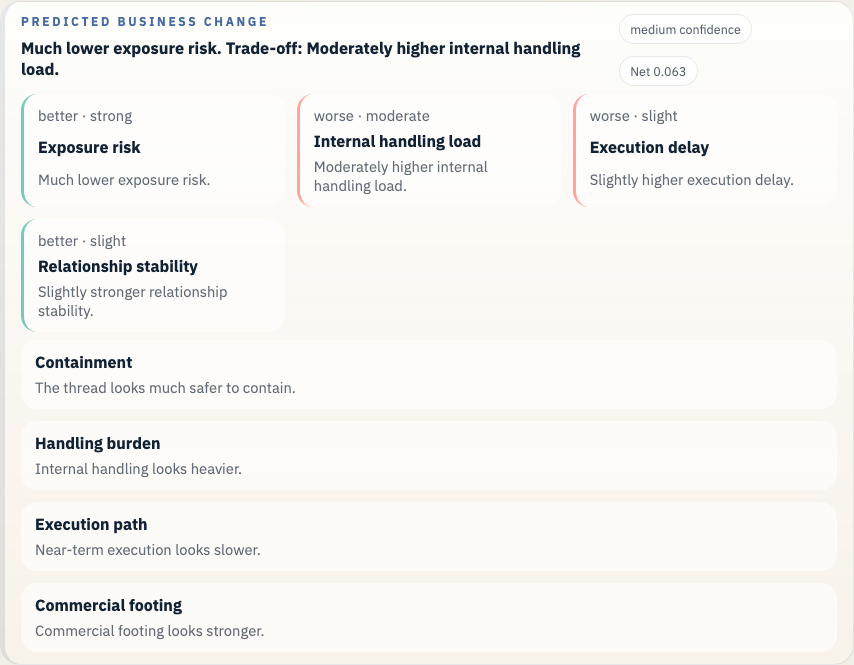
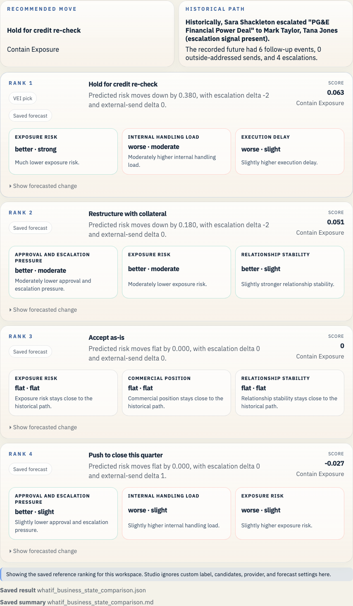

# Enron PG&E Power Deal Example

This example ties a commercial legal thread to the widening credit story around PG&E and gives the saved forecast a cleaner macro-credit hook than the original contract-only example.

## Open It In Studio

```bash
vei ui serve \
  --root docs/examples/enron-pge-power-deal/workspace \
  --host 127.0.0.1 \
  --port 3055
```

Open `http://127.0.0.1:3055`.





## What This Example Covers

- Historical branch point: Sara Shackleton is moving a PG&E financial power deal while the counterparty's macro-credit picture is deteriorating.
- Saved branch scene: 0 prior messages and 6 recorded future events
- Public-company slice at 1999-05-12: 1 financial checkpoints, 0 public news items, 336 market checkpoints, 0 credit checkpoints, and 0 regulatory checkpoints
- Saved LLM path: Hold the deal until PG&E credit is rechecked, ask for collateral, and keep legal and credit on one internal review loop.
- Saved forecast file: `whatif_heuristic_baseline_result.json`
- Business-state readout: Much lower exposure risk. Trade-off: Moderately higher internal handling load.
- Top ranked candidate: Hold for credit re-check

## Saved Files

- `workspace/`: saved workspace you can open in Studio
- `whatif_experiment_overview.md`: short human-readable run summary
- `whatif_experiment_result.json`: saved combined result for the example bundle
- `whatif_llm_result.json`: bounded message-path result
- `whatif_heuristic_baseline_result.json`: saved forecast result
- `whatif_business_state_comparison.md`: ranked comparison in business language
- `whatif_business_state_comparison.json`: structured comparison payload

## Other Enron Examples

- [Enron Master Agreement Example](../enron-master-agreement-public-context/README.md)
- [Enron Watkins Memo Example](../enron-watkins-memo/README.md)
- [Enron California Crisis Strategy Example](../enron-california-crisis-strategy/README.md)

## Refresh

```bash
python scripts/build_enron_example_bundles.py --bundle enron-pge-power-deal
python scripts/validate_whatif_artifacts.py docs/examples/enron-pge-power-deal
python scripts/capture_enron_bundle_screenshots.py --bundle enron-pge-power-deal
```

## Constraint

This repo now carries the Rosetta parquet archive, the source cache, and the raw Enron mail tar under `data/enron/`, so a fresh clone can open these saved examples and rebuild them without reaching into a sibling checkout.
