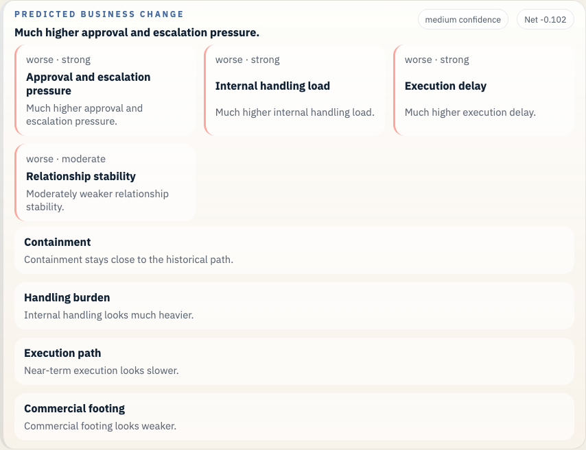

# Enron Watkins Memo Example

This example anchors the bankruptcy arc on the Watkins memo path and shows how the what-if flow reads an internal accounting warning against the public trust collapse already underway.

## Open It In Studio

```bash
vei ui serve \
  --root docs/examples/enron-watkins-memo/workspace \
  --host 127.0.0.1 \
  --port 3055
```

Open `http://127.0.0.1:3055`.




## What This Example Covers

- Historical branch point: Sherron Watkins is preserving the August warning path after Skilling's resignation and before the public collapse fully lands.
- Saved branch scene: 0 prior messages and 1 recorded future events
- Public-company slice at 2001-10-30: 11 financial checkpoints, 13 public news items, 944 market checkpoints, 4 credit checkpoints, and 1 regulatory checkpoints
- Saved LLM path: Escalate the memo to Ken Lay, the audit committee, and internal legal, preserve the written record, and pause any broad reassurance until the accounting questions are reviewed.
- Saved forecast file: `whatif_heuristic_baseline_result.json`
- Business-state readout: Much higher approval and escalation pressure.
- Top ranked candidate: Send the warning anonymously

## Saved Files

- `workspace/`: saved workspace you can open in Studio
- `whatif_experiment_overview.md`: short human-readable run summary
- `whatif_experiment_result.json`: saved combined result for the example bundle
- `whatif_llm_result.json`: bounded message-path result
- `whatif_heuristic_baseline_result.json`: saved forecast result
- `whatif_business_state_comparison.md`: ranked comparison in business language
- `whatif_business_state_comparison.json`: structured comparison payload

## Other Enron Examples

- [Enron Master Agreement Example](../enron-master-agreement-public-context/README.md)
- [Enron California Crisis Strategy Example](../enron-california-crisis-strategy/README.md)
- [Enron PG&E Power Deal Example](../enron-pge-power-deal/README.md)

## Refresh

```bash
python scripts/build_enron_example_bundles.py --bundle enron-watkins-memo
python scripts/validate_whatif_artifacts.py docs/examples/enron-watkins-memo
python scripts/capture_enron_bundle_screenshots.py --bundle enron-watkins-memo
```

## Constraint

This repo now carries the Rosetta parquet archive, the source cache, and the raw Enron mail tar under `data/enron/`, so a fresh clone can open these saved examples and rebuild them without reaching into a sibling checkout.
